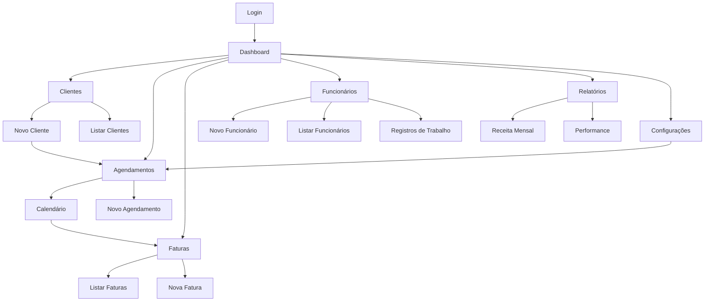

## 1. Visão Geral do Produto

Sistema CRM + Faturamento completo para gerenciamento de clientes, agendamentos e emissão de faturas para empresa de limpeza pós-obra. 

O sistema permite cadastrar clientes, agendar serviços, emitir faturas em PDF e acompanhar a receita do negócio. Desenvolvido como PWA para funcionar perfeitamente em dispositivos móveis, ideal para pequenos negócios de limpeza que precisam organizar seus processos de forma simples e eficiente.

**Target:** Pequenos empresários do setor de limpeza, começando com Enzo Fermiano

## 2. Funcionalidades Principais

### 2.1 Tipos de Usuários

| Tipo de Usuário | Método de Acesso | Permissões |
|----------------|------------------|------------|
| Administrador | Magic link via email | Acesso completo a todas as funcionalidades do sistema |

### 2.2 Módulos de Funcionalidades

O sistema CRM + Faturamento consiste nas seguintes páginas principais:

1. **Dashboard**: Visão geral do negócio com cards de resumo, gráfico de receita mensal e próximos agendamentos
2. **Clientes**: Listagem, cadastro e edição de clientes com dados completos
3. **Agendamentos**: Calendário interativo para visualização e criação de agendamentos
4.5. **Faturas**: Listagem e emissão de faturas em PDF para serviços realizados
6. **Funcionários**: Controle completo de funcionários, registros de trabalho e pagamentos
7. **Relatórios**: Análise de receitas, serviços mais rentáveis e performance mensal
8. **Configurações**: Dados da empresa e personalização do sistema

### 2.3 Detalhamento das Páginas

| Página | Módulo | Descrição das Funcionalidades |
|--------|--------|------------------------------|
| Login | Autenticação | Acesso via magic link enviado por email, sem senha |
| Dashboard | Cards de Resumo | Exibir total de clientes, receita do mês, serviços pendentes e concluídos |
| Dashboard | Gráfico de Receita | Gráfico de linha mostrando evolução da receita nos últimos 6 meses |
| Dashboard | Próximos Agendamentos | Lista dos próximos 5 agendamentos com cliente e horário |
| Clientes | Listagem | Tabela com busca, filtros e paginação de clientes cadastrados |
| Clientes | Cadastro | Formulário com nome, email, telefone, endereço completo e observações |
| Clientes | Edição | Permitir alterar todos os dados do cliente |
| Clientes | Exclusão | Remover cliente com confirmação (apenas se não tiver agendamentos) |
| Clientes | Ações Rápidas | Botão para agendar serviço diretamente da listagem |
| Agendamentos | Calendário | Visualização mensal com eventos coloridos por status |
| Agendamentos | Criação | Modal com seleção de cliente, data, horário, tipo de serviço e valor |
| Agendamentos | Edição | Alterar data, horário, status e observações do agendamento |
| Agendamentos | Status | Marcado, Confirmado, Em Andamento, Concluído, Cancelado |
| Agendamentos | Visualização Diária | Lista detalhada de agendamentos do dia selecionado |
| Faturas | Listagem | Tabela com faturas emitidas, status e valores |
| Faturas | Emissão | Gerar PDF automaticamente com dados do serviço e cliente |
| Faturas | Visualização | Pré-visualização da fatura antes de emitir |
| Faturas | Download | Baixar fatura em PDF com layout profissional |
| Faturas | Envio | Enviar fatura por email para o cliente (opcional) |
| Funcionários | Listagem | Tabela com busca e filtros de funcionários ativos e inativos |
| Funcionários | Cadastro | Formulário com nome, CPF, email, telefone, cargo, diária padrão (R$150) |
| Funcionários | Edição | Permitir alterar todos os dados do funcionário |
| Funcionários | Exclusão | Remover funcionário com confirmação |
| Funcionários | Registros de Trabalho | Cadastrar dias trabalhados, calcular total a pagar automaticamente |
| Funcionários | Controle de Pagamento | Marcar registros como pagos/pendentes, visualizar total a pagar |
| Funcionários | Dashboard Resumo | Mostrar total a pagar, registros pendentes e histórico de pagamentos |
| Relatórios | Receita Mensal | Valor total de serviços concluídos por mês |
| Relatórios | Serviços Mais Rentáveis | Ranking dos tipos de serviço mais lucrativos |
| Relatórios | Performance | Comparativo de receita entre meses |
| Relatórios | Exportação | Exportar dados em formato CSV ou Excel |
| Configurações | Dados da Empresa | Nome, CNPJ, endereço, telefone e logo |
| Configurações | Dados Bancários | Informações para fatura (opcional) |
| Configurações | Tipos de Serviço | Cadastrar e editar tipos de serviço com valores base |

## 3. Fluxo Principal do Usuário

### Fluxo do Administrador

1. **Primeiro Acesso**: Recebe magic link por email → Acessa dashboard → Configura dados da empresa
2. **Cadastro de Cliente**: Acessa página de clientes → Clica em "Novo Cliente" → Preenche formulário → Salva
3. **Agendamento**: Acessa calendário → Seleciona data → Clica em "Novo Agendamento" → Escolhe cliente e serviço → Confirma
3. **Emissão de Fatura**: Acessa faturas → Clica em "Nova Fatura" → Seleciona serviço concluído → Visualiza → Emite PDF
4. **Gestão de Funcionários**: Acessa funcionários → Cadastra novo funcionário → Registra dias trabalhados → Controla pagamentos
5. **Acompanhamento**: Visualiza dashboard regularmente → Acessa relatórios mensais → Exporta dados quando necessário

## 4. Design da Interface

### 4.1 Estilo Visual

- **Cores Primárias**: Azul profissional (#2563EB) e branco
- **Cores Secundárias**: Verde para status positivo (#10B981), vermelho para alertas (#EF4444)
- **Botões**: Estilo arredondado com sombras suaves, hover effects suaves
- **Tipografia**: Fonte moderna e limpa (Inter ou similar), tamanhos: 14px para texto, 16px para labels, 20px+ para títulos
- **Layout**: Card-based com navegação lateral, design clean e minimalista
- **Ícones**: Ícones modernos do Heroicons ou Lucide React

### 4.2 Elementos por Página

| Página | Módulo | Elementos de UI |
|--------|--------|----------------|
| Login | Formulário | Fundo gradiente suave, card centralizado, campo de email elegante, botão de submit primário |
| Dashboard | Cards | Cards com bordas arredondadas, ícones grandes coloridos, números em fonte bold, variação de cor por status |
| Dashboard | Gráfico | Gráfico de linha clean com tooltips hover, cores harmoniosas, grid suave |
| Clientes | Tabela | Tabela zebra com hover effects, botões de ação compactos, barra de busca com ícone |
| Clientes | Formulário | Inputs com bordas arredondadas, labels acima dos campos, validação visual em tempo real |
| Agendamentos | Calendário | Calendário moderno com eventos em badges coloridos, navegação intuitiva |
| Faturas | Listagem | Status com badges coloridos, botões de download com ícones, preview em modal |
| Relatórios | Gráficos | Gráficos de barras e pizza com paleta de cores profissional, cards de métricas |

### 4.3 Responsividade

- **Mobile-First**: Design otimizado para smartphones e tablets
- **PWA**: Funciona como app nativo em dispositivos móveis
- **Touch-Friendly**: Botões e elementos com área de toque adequada (mínimo 44px)
- **Breakpoints**: Mobile (< 640px), Tablet (640px - 1024px), Desktop (> 1024px)
- **Navegação**: Menu hamburger em mobile, sidebar em desktop
- **Tabelas**: Horizontal scroll em mobile, colunas adaptativ