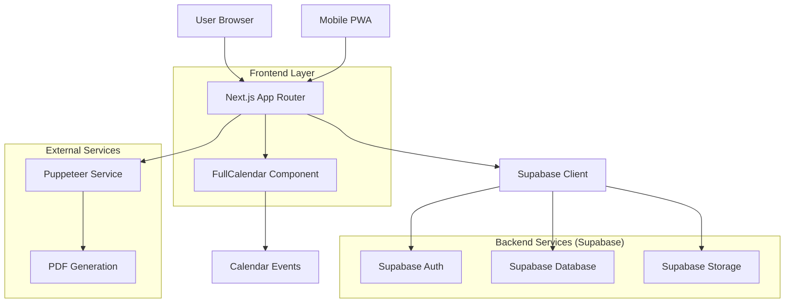
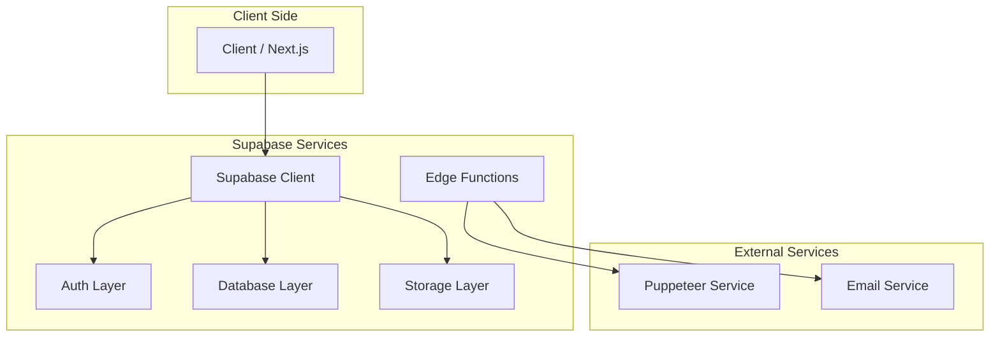
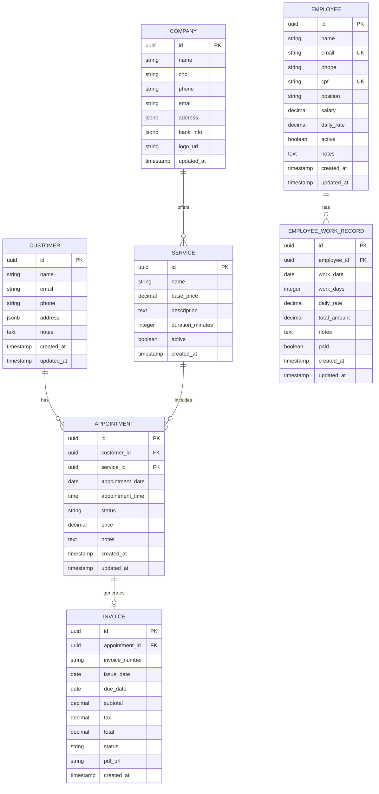

## 1. Arquitetura do Sistema



## 2. Stack Tecnológica

- **Frontend**: Next.js 14 + TypeScript + TailwindCSS
- **Backend**: Supabase (BaaS)
- **ORM**: Prisma Client
- **Banco de Dados**: PostgreSQL (via Supabase)
- **Autenticação**: Supabase Auth (Magic Link)
- **Storage**: Supabase Storage
- **UI Components**: HeadlessUI + Heroicons
- **Calendário**: FullCalendar React
- **PDF Generation**: Puppeteer
- **PWA**: next-pwa
- **Deploy**: Vercel

## 3. Definições de Rotas

| Rota | Propósito |
|------|-----------|
| `/` | Dashboard principal com visão geral do negócio |
| `/login` | Página de autenticação com magic link |
| `/clientes` | Listagem e gerenciamento de clientes |
| `/clientes/novo` | Formulário de cadastro de novo cliente |
| `/clientes/[id]/editar` | Edição de cliente existente |
| `/agendamentos` | Calendário de agendamentos |
| `/agendamentos/novo` | Criação de novo agendamento |
| `/agendamentos/[id]/editar` | Edição de agendamento |
| `/faturas` | Listagem de faturas emitidas |
| `/faturas/nova` | Emissão de nova fatura |
| `/faturas/[id]` | Visualização e download de fatura |
| `/funcionarios` | Listagem e gerenciamento de funcionários |
| `/funcionarios/novo` | Cadastro de novo funcionário |
| `/funcionarios/[id]/editar` | Edição de funcionário existente |
| `/funcionarios/[id]/registros` | Registros de trabalho do funcionário |
| `/relatorios` | Página de relatórios e análises |
| `/configuracoes` | Configurações do sistema e empresa |

## 4. Definições de APIs

### 4.1 Supabase Edge Functions

#### Geração de PDF
```
POST /api/generate-invoice-pdf
```

Request:
| Parâmetro | Tipo | Obrigatório | Descrição |
|-----------|------|-------------|-----------|
| invoice_id | string | true | ID da fatura no banco de dados |
| company_data | object | true | Dados da empresa para o PDF |
| customer_data | object | true | Dados do cliente |
| service_data | object | true | Dados do serviço prestado |

Response:
| Parâmetro | Tipo | Descrição |
|-----------|------|-------------|
| pdf_url | string | URL temporária para download do PDF |
| success | boolean | Status da geração |

#### Envio de Email
```
POST /api/send-invoice-email
```

Request:
| Parâmetro | Tipo | Obrigatório | Descrição |
|-----------|------|-------------|-----------|
| invoice_id | string | true | ID da fatura |
| customer_email | string | true | Email do cliente |
| pdf_url | string | true | URL do PDF gerado |

### 4.2 Tipos TypeScript

```typescript
// Types principais
interface Customer {
  id: string
  name: string
  email: string
  phone: string
  address: {
    street: string
    number: string
    complement?: string
    neighborhood: string
    city: string
    state: string
    zipCode: string
  }
  notes?: string
  createdAt: Date
  updatedAt: Date
}

interface Service {
  id: string
  name: string
  basePrice: number
  description?: string
  duration: number // em minutos
  active: boolean
}

interface Appointment {
  id: string
  customerId: string
  serviceId: string
  date: Date
  time: string
  status: 'scheduled' | 'confirmed' | 'in-progress' | 'completed' | 'cancelled'
  price: number
  notes?: string
  createdAt: Date
  updatedAt: Date
}

interface Invoice {
  id: string
  appointmentId: string
  invoiceNumber: string
  issueDate: Date
  dueDate: Date
  subtotal: number
  tax: number
  total: number
  status: 'pending' | 'paid' | 'overdue' | 'cancelled'
  pdfUrl?: string
  createdAt: Date
}

interface Company {
  id: string
  name: string
  cnpj?: string
  phone: string
  email: string
  address: {
    street: string
    number: string
    complement?: string
    neighborhood: string
    city: string
    state: string
    zipCode: string
  }
  bankInfo?: {
    bank: string
    agency: string
    account: string
    accountType: 'checking' | 'savings'
  }
  logoUrl?: string
}

interface Employee {
  id: string
  name: string
  email?: string
  phone: string
  cpf: string
  position: string
  salary?: number
  dailyRate: number
  active: boolean
  notes?: string
  createdAt: Date
  updatedAt: Date
}

interface EmployeeWorkRecord {
  id: string
  employeeId: string
  workDate: Date
  workDays: number
  dailyRate: number
  totalAmount: number
  notes?: string
  paid: boolean
  createdAt: Date
  updatedAt: Date
}
```

## 5. Arquitetura do Servidor



## 6. Modelo de Dados

### 6.1 Diagrama ER



### 6.2 Definições DDL

```sql
-- Tabela de Clientes
CREATE TABLE customers (
    id UUID PRIMARY KEY DEFAULT gen_random_uuid(),
    name VARCHAR(255) NOT NULL,
    email VARCHAR(255) UNIQUE NOT NULL,
    phone VARCHAR(20) NOT NULL,
    address JSONB NOT NULL,
    notes TEXT,
    created_at TIMESTAMP WITH TIME ZONE DEFAULT NOW(),
    updated_at TIMESTAMP WITH TIME ZONE DEFAULT NOW()
);

-- Tabela de Serviços
CREATE TABLE services (
    id UUID PRIMARY KEY DEFAULT gen_random_uuid(),
    name VARCHAR(255) NOT NULL,
    base_price DECIMAL(10,2) NOT NULL,
    description TEXT,
    duration_minutes INTEGER NOT NULL DEFAULT 60,
    active BOOLEAN DEFAULT true,
    created_at TIMESTAMP WITH TIME ZONE DEFAULT NOW()
);

-- Tabela de Agendamentos
CREATE TABLE appointments (
    id UUID PRIMARY KEY DEFAULT gen_random_uuid(),
    customer_id UUID REFERENCES customers(id) ON DELETE CASCADE,
    service_id UUID REFERENCES services(id) ON DELETE CASCADE,
    appointment_date DATE NOT NULL,
    appointment_time TIME NOT NULL,
    status VARCHAR(20) NOT NULL DEFAULT 'scheduled' 
        CHECK (status IN ('scheduled', 'confirmed', 'in-progress', 'completed', 'cancelled')),
    price DECIMAL(10,2) NOT NULL,
    notes TEXT,
    created_at TIMESTAMP WITH TIME ZONE DEFAULT NOW(),
    updated_at TIMESTAMP WITH TIME ZONE DEFAULT NOW()
);

-- Tabela de Faturas
CREATE TABLE invoices (
    id UUID PRIMARY KEY DEFAULT gen_random_uuid(),
    appointment_id UUID UNIQUE REFERENCES appointments(id) ON DELETE CASCADE,
    invoice_number VARCHAR(50) UNIQUE NOT NULL,
    issue_date DATE NOT NULL DEFAULT CURRENT_DATE,
    due_date DATE NOT NULL DEFAULT CURRENT_DATE + INTERVAL '30 days',
    subtotal DECIMAL(10,2) NOT NULL,
    tax DECIMAL(10,2) DEFAULT 0,
    total DECIMAL(10,2) NOT NULL,
    status VARCHAR(20) NOT NULL DEFAULT 'pending'
        CHECK (status IN ('pending', 'paid', 'overdue', 'cancelled')),
    pdf_url TEXT,
    created_at TIMESTAMP WITH TIME ZONE DEFAULT NOW()
);

-- Tabela de Configurações da Empresa
CREATE TABLE company (
    id UUID PRIMARY KEY DEFAULT gen_random_uuid(),
    name VARCHAR(255) NOT NULL,
    cnpj VARCHAR(20),
    phone VARCHAR(20) NOT NULL,
    email VARCHAR(255) NOT NULL,
    address JSONB NOT NULL,
    bank_info JSONB,
    logo_url TEXT,
    updated_at TIMESTAMP WITH TIME ZONE DEFAULT NOW()
);

-- Índices para performance
CREATE INDEX idx_customers_email ON customers(email);
CREATE INDEX idx_customers_name ON customers(name);
CREATE INDEX idx_appointments_customer_id ON appointments(customer_id);
CREATE INDEX idx_appointments_service_id ON appointments(service_id);
CREATE INDEX idx_appointments_date ON appointments(appointment_date);
CREATE INDEX idx_appointments_status ON appointments(status);
CREATE INDEX idx_invoices_appointment_id ON invoices(appointment_id);
CREATE INDEX idx_invoices_status ON invoices(status);
CREATE INDEX idx_invoices_issue_date ON invoices(issue_date);

-- Tabela de Funcionários
CREATE TABLE employees (
    id UUID PRIMARY KEY DEFAULT gen_random_uuid(),
    name VARCHAR(255) NOT NULL,
    email VARCHAR(255) UNIQUE,
    phone VARCHAR(20) NOT NULL,
    cpf VARCHAR(14) UNIQUE NOT NULL,
    position VARCHAR(100) NOT NULL DEFAULT 'Funcionário',
    salary DECIMAL(10,2),
    daily_rate DECIMAL(10,2) NOT NULL DEFAULT 150.00,
    active BOOLEAN DEFAULT true,
    notes TEXT,
    created_at TIMESTAMP WITH TIME ZONE DEFAULT NOW(),
    updated_at TIMESTAMP WITH TIME ZONE DEFAULT NOW()
);

-- Tabela de Registros de Trabalho
CREATE TABLE employee_work_records (
    id UUID PRIMARY KEY DEFAULT gen_random_uuid(),
    employee_id UUID REFERENCES employees(id) ON DELETE CASCADE,
    work_date DATE NOT NULL,
    work_days DECIMAL(3,1) NOT NULL DEFAULT 1,
    daily_rate DECIMAL(10,2) NOT NULL DEFAULT 150.00,
    total_amount DECIMAL(10,2) NOT NULL,
    notes TEXT,
    paid BOOLEAN DEFAULT false,
    created_at TIMESTAMP WITH TIME ZONE DEFAULT NOW(),
    updated_at TIMESTAMP WITH TIME ZONE DEFAULT NOW()
);

-- Índices para performance
CREATE INDEX idx_employees_cpf ON employees(cpf);
CREATE INDEX idx_employees_email ON employees(email);
CREATE INDEX idx_employees_active ON employees(active);
CREATE INDEX idx_employee_work_records_employee_id ON employee_work_records(employee_id);
CREATE INDEX idx_employee_work_records_work_date ON employee_work_records(work_date);
CREATE INDEX idx_employee_work_records_paid ON employee_work_records(paid);

-- Permissões Supabase
GRANT SELECT ON customers TO anon;
GRANT ALL ON customers TO authenticated;
GRANT SELECT ON services TO anon;
GRANT ALL ON services TO authenticated;
GRANT SELECT ON appointments TO anon;
GRANT ALL ON appointments TO authenticated;
GRANT SELECT ON invoices TO anon;
GRANT ALL ON invoices TO authenticated;
GRANT SELECT ON company TO anon;
GRANT ALL ON company TO authenticated;
GRANT SELECT ON employees TO anon;
GRANT ALL ON employees TO authenticated;
GRANT SELECT ON employee_work_records TO anon;
GRANT ALL ON employee_work_records TO authenticated;

-- RLS (Row Level Security) Policies
ALTER TABLE customers ENABLE ROW LEVEL SECURITY;
ALTER TABLE services ENABLE ROW LEVEL SECURITY;
ALTER TABLE appointments ENABLE ROW LEVEL SECURITY;
ALTER TABLE invoices ENABLE ROW LEVEL SECURITY;
ALTER TABLE company ENABLE ROW LEVEL SECURITY;
ALTER TABLE employees ENABLE ROW LEVEL SECURITY;
ALTER TABLE employee_work_records ENABLE ROW LEVEL SECURITY;

-- Policies para usuários autenticados
CREATE POLICY "Usuários autenticados podem ver todos os clientes" ON customers
    FOR SELECT TO authenticated USING (true);

CREATE POLICY "Usuários autenticados podem gerenciar clientes" ON customers
    FOR ALL TO authenticated USING (true);

CREATE POLICY "Usuários autenticados podem ver todos os serviços" ON services
    FOR SELECT TO authenticated USING (true);

CREATE POLICY "Usuários autenticados podem gerenciar serviços" ON services
    FOR ALL TO authenticated USING (true);

CREATE POLICY "Usuários autenticados podem ver todos os agendamentos" ON appointments
    FOR SELECT TO authenticated USING (true);

CREATE POLICY "Usuários autenticados podem gerenciar agendamentos" ON appointments
    FOR ALL TO authenticated USING (true);

CREATE POLICY "Usuários autenticados podem ver todas as faturas" ON invoices
    FOR SELECT TO authenticated USING (true);

CREATE POLICY "Usuários autenticados podem gerenciar faturas" ON invoices
    FOR ALL TO authenticated USING (true);

CREATE POLICY "Usuários autenticados podem ver configurações" ON company
    FOR SELECT TO authenticated USING (true);

CREATE POLICY "Usuários autenticados podem gerenciar configurações" ON company
    FOR ALL TO authenticated USING (true);

CREATE POLICY "Usuários autenticados podem ver todos os funcionários" ON employees
    FOR SELECT TO authenticated USING (true);

CREATE POLICY "Usuários autenticados podem gerenciar funcionários" ON employees
    FOR ALL TO authenticated USING (true);

CREATE POLICY "Usuários autenticados podem ver todos os registros de trabalho" ON employee_work_records
    FOR SELECT TO authenticated USING (true);

CREATE POLICY "Usuários autenticados podem gerenciar registros de trabalho" ON employee_work_records
    FOR ALL TO authenticated USING (true);

-- Dados iniciais
INSERT INTO services (name, base_price, description, duration_minutes) VALUES
    ('Limpeza Pós-Obra Residencial', 350.00, 'Limpeza completa após obra residencial', 480),
    ('Limpeza Pós-Obra Comercial', 450.00, 'Limpeza completa após obra comercial', 600),
    ('Limpeza de Vidros e Janelas', 120.00, 'Limpeza especializada em vidros', 120),
    ('Limpeza de Piso e Cerâmica', 180.00, 'Limpeza profunda de pisos', 240);

INSERT INTO company (name, phone, email, address) VALUES
    ('Casa Limpa - Serviços de Limpeza', '(11) 99999-9999', 'contato@casalimpa.com.br', 
     '{"street": "Rua Exemplo", "number": "123", "neighborhood": "Centro", "city": "São Paulo", "state": "SP", "zipCode": "01000-000"}');
```

## 7. Configurações de Deploy

### Vercel Configuration (vercel.json)
```json
{
  "builds": [
    {
      "src": "package.json",
      "use": "@vercel/next"
    }
  ],
  "env": {
    "NEXT_PUBLIC_SUPABASE_URL": "@next_public_supabase_url",
    "NEXT_PUBLIC_SUPABASE_ANON_KEY": "@next_public_supabase_anon_key",
    "SUPABASE_SERVICE_ROLE_KEY": "@supabase_service_role_key"
  },
  "functions": {
    "api/generate-invoice-pdf.ts": {
      "maxDuration": 30
    }
  }
}
```

### PWA Configuration (next.config.js)
```javascript
const withPWA = require('next-pwa')({
  dest: 'public',
  register: true,
  skipWaiting: true,
  disable: process.env.NODE_ENV === 'development'
})

module.exports = withPWA({
  reactStrictMode: true,
  swcMinify: true,
  images: {
    domains: ['your-supabase-domain.supabase.co'],
  },
})
```

### Supabase Storage Buckets

1. **company-logos**: Para armazenar logos da empresa
   - Política: Acesso público para leitura
   - Tamanho máximo: 2MB por arquivo
   - Formatos aceitos: PNG, JPG, JPEG, WebP

2. **invoice-pdfs**: Para armazenar faturas geradas
   - Política: Acesso privado, apenas usuários autenticados
   - Tamanho máximo: 10MB por arquivo
   - Formato: PDF apenas